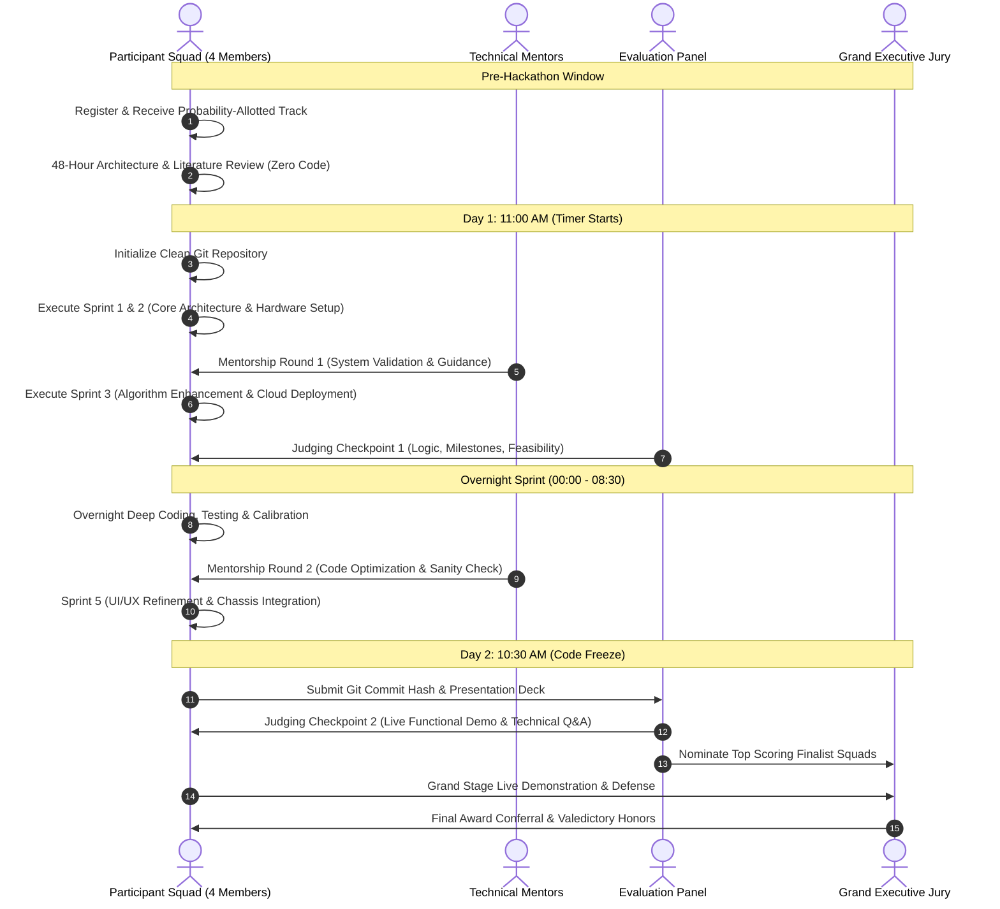

# ZENTRIX 2026 : 24-Hour National Hackathon

Organized by the IEEE Industrial Electronics Society (IES) Student Branch Chapter  
In Association with Sri Sairam Engineering College (Autonomous), Chennai, Tamil Nadu, India  
Event Dates: September 30, 2026 to October 01, 2026  
Official Registration Portal: https://forms.gle/AffoDaBvDCGSVi137

---

## Table of Contents

- [Executive Summary](#executive-summary)
- [Institutional Background](#institutional-background)
- [Guiding Philosophy: Vision and Mission](#guiding-philosophy-vision-and-mission)
- [Event Operational Architecture](#event-operational-architecture)
- [Phase-by-Phase Operational Flow](#phase-by-phase-operational-flow)
- [24-Hour Event Schedule Breakdown](#24-hour-event-schedule-breakdown)
- [Technical Domains and Problem Statements](#technical-domains-and-problem-statements)
- [Official Rules and Regulations: The 15 Governance Principles](#official-rules-and-regulations-the-15-governance-principles)
- [Evaluation Rubric and Assessment Criteria](#evaluation-rubric-and-assessment-criteria)
- [Organizational and Leadership Structure](#organizational-and-leadership-structure)
- [Web Platform Technical Stack](#web-platform-technical-stack)
- [Local Setup and Deployment Guide](#local-setup-and-deployment-guide)
- [Venue and Institutional Coordinates](#venue-and-institutional-coordinates)

---

## Executive Summary

ZENTRIX is an elite 24-hour national technical hackathon set in an intellectually challenging, high-stakes atmosphere inspired by the mysterious and analytical world of Nevermore Academy. It serves as an intensive crucible where technology, creative lateral thinking, and unconventional problem-solving converge.

Participants encounter multidisciplinary problem statements that demand mathematical rigor, scientific exploration, software proficiency, hardware calibration, and product execution. Over 24 continuous hours, interdisciplinary teams of four engineers transform nascent concepts into fully functional, production-ready engineering solutions.

The event unites the ethos of intelligence, deep science, modern digital technology, and industrial innovation, establishing a competitive arena where technical constraints inspire transformative engineering breakthroughs.

---

## Institutional Background

### Sri Sairam Engineering College
Sri Sairam Engineering College (Autonomous), situated in Sai Leo Nagar, West Tambaram, Chennai, is an institution accredited by NAAC with an 'A+' Grade and with departments accredited by NBA. Established under the vision of Founder Chairman MJF. Ln. Leo Muthu and steered by Chairman and CEO Dr. Sai Prakash Leo Muthu, the institution fosters academic excellence, industry integration, and entrepreneurial leadership.

### IEEE Industrial Electronics Society (IES)
The IEEE Industrial Electronics Society (IES) is an international technical society of the Institute of Electrical and Electronics Engineers (IEEE). The society addresses the theory and application of electronics, controls, communications, instrumentation, and computational intelligence to industrial and manufacturing systems and processes.

---

## Guiding Philosophy: Vision and Mission

### The Vision
"The vision of the IES is to advance global prosperity by fostering technological innovation, enabling members' careers, and promoting community worldwide."

"The IES promotes the engineering process of creating, developing, integrating, sharing, and applying knowledge about electro- and information technologies and sciences for the benefit of humanity and the profession."

### The Strategic Mission Pillars

| Strategic Pillar | Focus Domain | Official Mission Statement |
| :--- | :--- | :--- |
| **M1 : Creativity** | Innovation Platform | To create an ecosystem that encourages innovation, creativity, and technology-driven problem solving. |
| **M2 : Impact** | Real-World Solutions | To challenge participants to develop practical, deployable, and scalable solutions to pressing global problems. |
| **M3 : Synergy** | Multidisciplinary Collaboration | To foster teamwork, communication, and interdisciplinary learning through competitive technical hackathons. |
| **M4 : Leadership** | Prototype Mastery | To empower students to transform abstract concepts into working prototypes while honing professional and technical leadership capabilities. |

---

## Event Operational Architecture

The operational trajectory of ZENTRIX spans pre-event allocation, active 24-hour engineering sprints, dual mentorship interventions, dual evaluation checkpoints, and final executive demonstrations.

### High-Level Architecture Flowchart

```mermaid
graph TD
    subgraph PreHackathon ["Stage 1: Pre-Hackathon & Discovery"]
        A[Participant Registration & Check-In] --> B[Rolling Dice Probability Engine]
        B --> C[Domain & Track Allocation]
        C --> D[Official Problem Statement Reveal]
        D --> E[48-Hour Strategic Research Window<br/>No Pre-Written Code Permitted]
    end

    subgraph DayOne ["Stage 2: Day 1 - Kickoff & Core Engineering"]
        E --> F[Formal Inauguration Ceremony]
        F --> G[11:00 AM : 24-Hour Timer Commences]
        G --> H[Sprint 1: System Architecture & Low-Level Design]
        H --> I[Sprint 2: Core Build & Firmware Synthesis]
        I --> J[Mentorship Round 1: Technical & Feasibility Audit]
    end

    subgraph NightSprint ["Stage 3: Night Phase - Deep Tech & Review"]
        J --> K[Sprint 3: Module Enhancement & Cloud Integration]
        K --> L[Judging Checkpoint 1: Logic & Milestone Review]
        L --> M[Midnight Energizer & Cognitive Reset]
        M --> N[Sprint 4: Overnight Deep Coding & Hardware Testing]
        N --> O[Mentorship Round 2: Pre-Dawn Optimization]
    end

    subgraph DayTwo ["Stage 4: Day 2 - Code Freeze & Finale"]
        O --> P[Sprint 5: Final Testing & UI/UX Polishing]
        P --> Q[10:30 AM : Strict Repository Code Freeze]
        Q --> R[Judging Checkpoint 2: Live Prototype Demonstrations]
        R --> S{Top Finalist Selection}
        S -->|Finalists| T[Grand Stage Pitch to Executive Jury]
        S -->|Standard Tracks| U[Final Score Compilation]
        T --> V[Valedictory Ceremony & Award Presentation]
        U --> V
    end

    classDef primary fill:#1E1035,stroke:#7C3AED,stroke-width:2px,color:#F3E8FF;
    classDef highlight fill:#2E1065,stroke:#A855F7,stroke-width:2px,color:#FFFFFF;
    classDef warning fill:#450A0A,stroke:#DC2626,stroke-width:2px,color:#FCA5A5;
    classDef success fill:#064E3B,stroke:#10B981,stroke-width:2px,color:#D1FAE5;

    class A,B,C,D,E primary;
    class F,H,I,K,M,N,P highlight;
    class G,Q warning;
    class J,L,O,R,S,T,U,V success;
```



### Comprehensive Vector Operational Map

Below is the complete visual layout of the 5-stage operational pipeline:


---

## Phase-by-Phase Operational Flow

The ZENTRIX hackathon follows an eleven-phase operational lifecycle:



### Phase Descriptions

1. **Phase 01 : Check-In and Verification**  
   Reporting, physical verification of team members, issue of identification credentials, hardware safety screening, and event workspace allocation.

2. **Phase 02 : Rolling Dice Probability Mechanics**  
   Unique track assignment determined through an algorithmic probability mechanism, testing squad agility across unfamiliar problem spaces.

3. **Phase 03 : Problem Statement Declaration**  
   Formal disclosure of detailed problem definitions, constraints, sample datasets, test criteria, and expected deliverables.

4. **Phase 04 : 48-Hour Preparation Window**  
   Strategic ideation, workflow design, architectural blueprinting, and reference literature survey. Writing production code prior to the start signal is strictly forbidden.

5. **Phase 05 : Official Hackathon Kickoff (11:00 AM)**  
   Commencement of the 24-hour chronometer. Squads initialize empty version-controlled repositories and start development.

6. **Phase 06 : Mentorship Round 1 (Technical Validation)**  
   Domain experts and senior faculty evaluate the low-level design, component compatibility, and architectural foundation, offering corrective guidance.

7. **Phase 07 : Judging Checkpoint 1 (Interim Progress Audit)**  
   The primary evaluation milestone where judges assess code commit progression, algorithmic structure, feasibility, and technical direction.

8. **Phase 08 : Overnight Deep Development**  
   Night sprint phase dedicated to cloud API integration, hardware calibration, database persistence, error handling, and end-to-end telemetry.

9. **Phase 09 : Final Code Freeze (10:30 AM, Day 2)**  
   Absolute repository lock. Subsequent commits are rejected. Presentation decks, demonstration links, and documentation are registered.

10. **Phase 10 : Judging Checkpoint 2 (Live Demonstration)**  
    Rigorous evaluation where teams demonstrate a fully working prototype. Presentation slides alone without active execution result in scoring penalties.

11. **Phase 11 : Grand Finale & Valedictory Ceremony**  
    Shortlisted top squads present on the main auditorium stage before the Grand Jury, followed by award conferral, cash prize distribution, and formal valediction.

---

## 24-Hour Event Schedule Breakdown

### Day 1 : September 30, 2026

| Time Slot | Program Activity | Operational Scope |
| :--- | :--- | :--- |
| 08:30 AM - 09:30 AM | Registration & Reporting | Credential verification, welcome kit distribution, booth allocation |
| 09:30 AM - 10:30 AM | Inauguration Ceremony | Keynote addresses by dignitaries, opening briefings by IES coordinators |
| 10:30 AM - 11:00 AM | Track Declaration & Briefing | Release of problem statements, rubric explanation, workspace briefing |
| **11:00 AM** | **Hackathon Commences (T=00:00)** | **24-hour timer starts; clean repository initialization** |
| 11:00 AM - 01:00 PM | Sprint 1: Architecture | Low-level software design, hardware schematic planning, API contract definition |
| 01:00 PM - 02:00 PM | Working Lunch | Networking and nutritional break |
| 02:00 PM - 05:00 PM | Sprint 2: Core Engineering | Algorithm synthesis, firmware compilation, primary module construction |
| 05:00 PM - 06:30 PM | Mentorship Round 1 | Technical validation, architectural auditing, mentor guidance |
| 06:30 PM - 08:00 PM | Sprint 3: Feature Integration | Refinement based on mentor feedback, edge case resolution, unit tests |
| 08:00 PM - 09:00 PM | Dinner Break | Squad refueling |
| 09:00 PM - 10:30 PM | Judging Checkpoint 1 | Milestone assessment: progress review, logic validation, feasibility score |
| 10:30 PM - 12:00 AM | Cloud & Backend Sprint | Backend hosting, database connectivity, communication protocols |

### Night Phase : October 01, 2026

| Time Slot | Program Activity | Operational Scope |
| :--- | :--- | :--- |
| 12:00 AM - 01:00 AM | Midnight Energizer | Refreshments, interactive technical trivia, cognitive reset |
| 01:00 AM - 03:30 AM | Sprint 4: Deep Coding | Overnight development, end-to-end integration, performance profiling |
| 03:30 AM - 04:30 AM | Mentorship Round 2 | Pre-dawn code review, bottleneck diagnosis, demo readiness check |
| 04:30 AM - 07:00 AM | Sprint 5: System Testing | Integration testing, hardware enclosure assembly, UI/UX polish |
| 07:00 AM - 08:30 AM | Breakfast & Refreshment | Morning personal break |

### Day 2 : October 01, 2026

| Time Slot | Program Activity | Operational Scope |
| :--- | :--- | :--- |
| 08:30 AM - 10:30 AM | Sprint 6: Final Polish | Demonstration rehearsal, presentation deck completion, readme finalization |
| **10:30 AM** | **Final Code Freeze (T=23:30)** | **Strict repository lock; commit hashes registered; zero further pushes** |
| 11:00 AM - 01:30 PM | Judging Checkpoint 2 | All-team live prototype execution, booth demonstrations, judge Q&A |
| 01:30 PM - 02:30 PM | Lunch Break | Deliberation window for evaluation panel |
| 02:30 PM - 04:00 PM | Grand Jury Pitch Stage | Shortlisted top finalist squads present on stage to the Grand Jury |
| 04:00 PM - 05:00 PM | Valedictory & Awards | Result announcements, award conferral, institutional closing remarks |

---

## Technical Domains and Problem Statements

ZENTRIX challenges participants across seven specialized engineering tracks:

```
+-------------------------------------------------------------------------------+
|                       ZENTRIX TECHNICAL TRACK PORTFOLIO                       |
+------------------------------------+------------------------------------------+
| 01. Industrial Automation          | Programmable logic, SCADA integration,   |
|     & Autonomous Robotics          | robotic manipulators, motion planning    |
+------------------------------------+------------------------------------------+
| 02. Smart Energy & Clean           | Grid telemetry, microgrid optimization,  |
|     Power Systems                  | renewable storage management             |
+------------------------------------+------------------------------------------+
| 03. Edge AI, Computer Vision       | Embedded inference, sensor fusion,       |
|     & Applied Machine Learning     | autonomous visual inspection, TinyML     |
+------------------------------------+------------------------------------------+
| 04. Internet of Things (IoT)       | LoRaWAN, MQTT/CoAP mesh networks,        |
|     & Cyber-Physical Systems       | industrial sensor nodes, telematics      |
+------------------------------------+------------------------------------------+
| 05. Cybersecurity & Secure         | Zero-trust protocols, embedded security, |
|     System Architectures           | network defense, threat detection        |
+------------------------------------+------------------------------------------+
| 06. Healthcare Engineering         | Biomedical monitoring, assistive haptics,|
|     & Assistive Technologies       | portable diagnostic instrumentation      |
+------------------------------------+------------------------------------------+
| 07. Open Innovation                | Novel interdisciplinary technologies     |
|     & Moonshot Solutions           | addressing unmapped societal challenges  |
+------------------------------------+------------------------------------------+
```

---

## Official Rules and Regulations: The 15 Governance Principles

To ensure absolute competitive integrity, fair play, and technical merit, all participants are bound by the 15 official governance principles of ZENTRIX:

| Rule Number | Governance Policy | Detailed Regulatory Mandate |
| :---: | :--- | :--- |
| **01** | Team Composition | Squads must comprise exactly four (4) verified student members. Cross-departmental and inter-disciplinary teams are permitted. Team rosters cannot be modified after registration closes. |
| **02** | 24-Hour Active Window | All software development, physical wiring, and firmware flashing must be performed strictly within the official 24-hour hackathon timeframe (11:00 AM Sept 30 to 10:30 AM Oct 01). |
| **03** | Zero Pre-Prepared Code | Working on pre-existing codebases, commercial templates, or pre-built prototypes is strictly prohibited. Version-controlled repositories must show the initial commit post-kickoff. |
| **04** | Plagiarism & Attribution | Direct plagiarism, unauthorized incorporation of intellectual property, or undocumented third-party assets will result in immediate disqualification. |
| **05** | Permissible AI Tools | The utilization of generative AI coding assistants (e.g., Copilot, LLM APIs, automated scaffolding) is permitted as productivity tools, provided all generated code is understood and explainable by team members. |
| **06** | Original Implementation | The underlying system architecture, data structures, integration logic, and core algorithms must be original work created by the squad during the hackathon. |
| **07** | Pre-Hackathon Preparation | Squads may conduct literature reviews, architectural sketching, and component sourcing during the 48-hour preparation window, but no programming may precede the start signal. |
| **08** | Open-Source Packages | Standard public open-source libraries, package managers (npm, pip, cargo), and frameworks are permitted, provided they are declared in the project's dependency manifest. |
| **09** | Mandatory Live Demo | Evaluation requires an operational, live demonstration of software or physical hardware. Slide presentations without a working prototype will receive severe scoring deductions. |
| **10** | Submission Deadlines | Code repositories, demonstration recordings, and pitch decks must be registered before the 10:30 AM code freeze on Day 2. Late submissions will incur progressive point deductions. |
| **11** | Fair Play and Integrity | Unprofessional behavior, sabotage of competitor workspaces, or academic dishonesty will lead to immediate expulsion from the premises. |
| **12** | Technical Infrastructure Conduct | Tampering with campus network equipment, attempting denial-of-service attacks, or engaging in unauthorized network sniffing will result in academic and legal sanctions. |
| **13** | Professional Code of Conduct | All participants must adhere to the IEEE Code of Ethics and institutional campus regulations. Institutional identification badges must remain visible at all times. |
| **14** | Finality of Judging | Decisions, marks, and rankings issued by the evaluation panel and IES executive committee are conclusive, final, and non-negotiable. |
| **15** | Disqualification Protocols | Violation of any rule above empowers the executive committee to summarily disqualify the offending squad without recourse. |

---

## Evaluation Rubric and Assessment Criteria

Submissions are evaluated through a standardized rubric totaling 100 points:

| Evaluation Criterion | Weightage | Assessment Metrics |
| :--- | :---: | :--- |
| **Innovation & Originality** | 25% | Novelty of approach, creative problem solving, differentiation from existing market solutions |
| **Technical Complexity & Architecture** | 25% | Depth of engineering, architectural soundness, code quality, component integration, robust error handling |
| **Prototype Execution & Completeness** | 25% | Functional prototype demonstrated live, fidelity to problem statement, feature maturity, operational reliability |
| **Real-World Viability & Scalability** | 15% | Commercial feasibility, computational efficiency, deployment practicality, user experience |
| **Presentation, Defense & Q&A** | 10% | Clarity of communication, mastery of technical concepts under panel questioning, structured presentation |

---

## Organizational and Leadership Structure

### Chief Patrons
- **Dr. Sai Prakash Leo Muthu** : Chairman and CEO, Sairam Institutions
- **Dr. J. Raja** : Principal, Sri Sairam Engineering College

### Faculty Advisors and Staff Coordinators
- **Dr. G. Prakash** : Faculty Advisor, IEEE IES Student Branch Chapter
- **Dr. G. Ravi** : Faculty Advisor, IEEE IES Student Branch Chapter
- **Mr. S. Surenderanath** : Faculty Advisor, IEEE IES Student Branch Chapter
- **Ms. S. Gayathri** : Faculty Advisor, IEEE IES Student Branch Chapter
- **Dr. R. Ashok Gandhi** : Faculty Advisor, IEEE IES Student Branch Chapter

### Student Office Bearers
The executive leadership of the IEEE IES Student Branch Chapter responsible for ZENTRIX:

1. **Chair**
   - **Reshmen R A** : Department of Electronics and Communication Engineering
   - **Sarveshwar S** : Department of Electronics and Communication Engineering
2. **Vice Chair**
   - **Akilan A** : Department of Electronics and Communication Engineering
   - **Manoranjithan M** : Department of Electronics and Communication Engineering
3. **Secretary**
   - **Ranjit K** : Department of Electronics and Communication Engineering
   - **Ezhil A** : Department of Electronics and Communication Engineering
4. **Treasurer**
   - **Abishake** : Department of Computer and Communication Engineering
   - **Hemna Gangadaran** : Department of Electronics and Communication Engineering
5. **Webmaster**
   - **Kishore S** : Department of Information Technology (Lead Platform Architect)
   - **Prathiksha S M** : Department of Information Technology
6. **Tech Lead**
   - **Akshay Kumar** : Department of Electronics and Communication Engineering
7. **Admin Assistant**
   - **Sujin Ram U S** : Department of Electronics and Communication Engineering

### MAGIC Members (Domain Specialists)

- **Mastermind (M)**:
  - Srikanth M (Department of Electrical and Electronics Engineering)
  - Ezhil M (Department of Electronics and Communication Engineering)
- **Advocate (A)**:
  - Joel John (Department of Electronics and Communication Engineering)
  - Johnson E (Department of Electrical and Electronics Engineering)
- **Guide (G)**:
  - Prahaladhan J (Department of Computer Science and Engineering)
  - Krithik Munusamy (Department of Electronics and Communication Engineering)
- **Influencer (I)**:
  - Akilan A (Department of Electronics and Communication Engineering)
  - Palaparthi Nandhini (Department of Computer Science and Engineering - Cyber Security)
- **Communicator (C)**:
  - Jessy Abi Doss A (Department of Electrical and Electronics Engineering)
  - Shivani K (Department of Computer Science and Engineering)

### Volunteers
- **Sudharshini B** : Department of Electronics and Communication Engineering
- **Divya sree D** : Department of Information Technology
- **Siva sree K** : Department of Electronics and Communication Engineering
- **Vidhu bala S A** : Department of Electronics and Communication Engineering

---

## Web Platform Technical Stack

The ZENTRIX official web platform is an engineering artifact developed from the ground up:

- **Core Framework**: Vanilla ECMAScript 6+ with semantic HTML5 for performance and low overhead
- **Styling Architecture**: Tailwind CSS 3.x with custom cyber/gothic design extensions
- **3D Graphics & Rendering**: Three.js WebGL rendering for dynamic cyber particles and interactive visual elements
- **Iconography**: Lucide Icons vector system
- **Typography**: Clash Display, Space Grotesk, and JetBrains Mono fonts
- **Build Engine**: Vite 5.x bundling pipeline with PostCSS and Autoprefixer
- **Deployment Pipeline**: Static hosting via Surge.sh CDN and GitHub Pages

---

## Local Setup and Deployment Guide

### Prerequisites
- **Node.js**: Version 18.0.0 or higher
- **npm**: Version 9.0.0 or higher
- **Git**: Version 2.30.0 or higher

### Installation Procedure

1. Clone the repository:
   ```bash
   git clone https://github.com/Kishore-dev-21/zentrix.git
   cd zentrix
   ```

2. Install project dependencies:
   ```bash
   npm install
   ```

3. Launch the local development server:
   ```bash
   npm run dev
   ```
   Access the portal at `http://localhost:5173/`.

4. Compile for production deployment:
   ```bash
   npm run build
   ```
   Production artifacts are generated in the `dist/` directory.

5. Preview the production build locally:
   ```bash
   npm run preview
   ```

---

## Venue and Institutional Coordinates

- **Host Institution**: Sri Sairam Engineering College (Autonomous)
- **Campus**: Sai Leo Nagar, West Tambaram, Chennai - 600044, Tamil Nadu, India
- **Organizing Body**: IEEE Industrial Electronics Society (IES) Student Branch Chapter
- **Official Portal**: https://zentrix-hackathon-2026.surge.sh
- **Repository**: https://github.com/Kishore-dev-21/zentrix
- **Registration**: https://forms.gle/AffoDaBvDCGSVi137

---

*ZENTRIX 2026 &bull; IEEE Industrial Electronics Society Student Branch Chapter &bull; Sri Sairam Engineering College*
